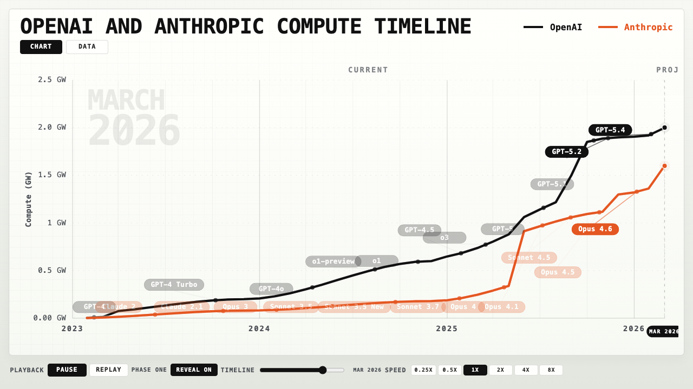

# OpenAI vs Anthropic Compute Wars

This repository packages a site-backed dataset of frontier data centers and a set of derived tables that roll those sites up into an OpenAI and Anthropic compute timeline.

The goal is straightforward: make it easy to inspect the underlying data, follow the sources, and open the chart without digging through working files.

## Start Here

- `data/raw/data_centers.csv` is the main facility table. Each row includes notes and source links.
- `data/raw/data_center_timelines.csv` is the dated timeline behind each facility.
- `data/raw/openai_anthropic_major_model_releases.csv` is the model release table used for the chart overlays.
- `data/reference/` holds supporting equipment reference tables that are kept alongside the main dataset.
- `data/derived/company_capacity_by_snapshot.csv` shows the site-backed capacity rollup by company and snapshot date.
- `data/derived/openai_anthropic_publishable_view.csv` is the clean yearly view used for the published chart.
- `docs/index.html` is the main static-site entry point.
- `docs/openai-anthropic-training-story.html` is the direct chart file.
- `data/package/` is the self-contained reconciliation package with source inputs, derived tables, and a manifest.

## Rebuild

Run `python3 scripts/build_release.py` to regenerate the derived tables, package files, and HTML docs.

## Data And Sources

The easiest place to start is `data/raw/data_centers.csv`.

Every named site keeps its supporting links in the `Selected Sources` column, and the timeline rows in `data/raw/data_center_timelines.csv` provide the dated buildout record used by the derived outputs.

## License

- Code in this repository is released under the ISC license. See `LICENSE`.
- The underlying Epoch AI data is available under the Creative Commons Attribution 4.0 license. See `DATA-LICENSE.md`.

## Citation

Epoch AI, "Frontier Data Centers". Published online at `https://epoch.ai/data/data-centers`.
